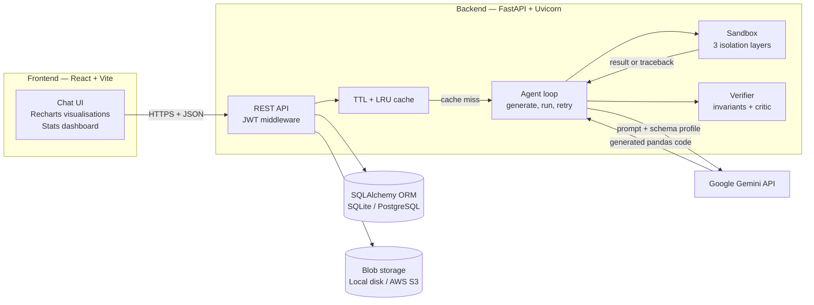
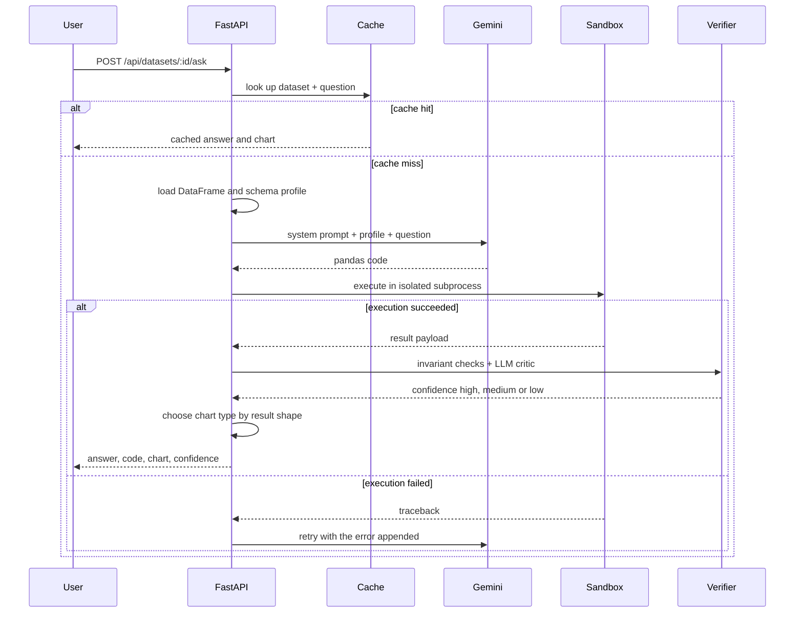
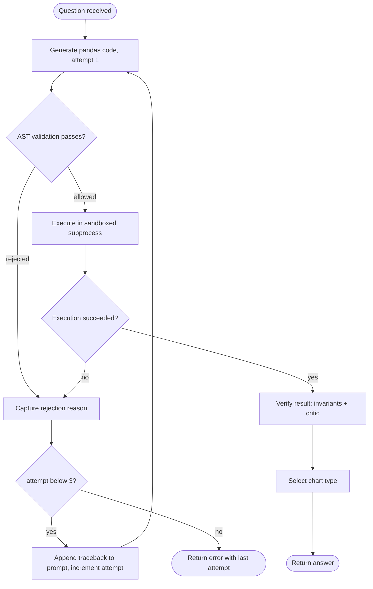
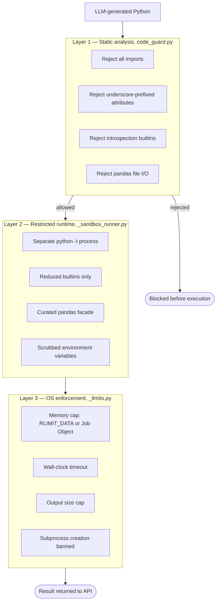

# Dialect — LLM-Powered Data Analysis App

**Ask questions about any spreadsheet in plain English. Get real answers, computed by real code.**

Dialect is a full-stack, production-oriented web application that turns natural-language questions into executable **pandas** code, runs that code inside a hardened **sandbox**, and returns a verified answer with an automatically chosen chart.

Upload a CSV, Excel or JSON file, ask *"which region grew fastest last quarter?"*, and Dialect writes the analysis, executes it, checks its own work, and plots the result.


---

## Table of contents

- [Why this exists](#why-this-exists)
- [Key features](#key-features)
- [System architecture](#system-architecture)
- [How a question is answered](#how-a-question-is-answered)
- [The self-correcting retry loop](#the-self-correcting-retry-loop)
- [Security: executing untrusted LLM-generated code](#security-executing-untrusted-llm-generated-code)
- [Answer verification and confidence scoring](#answer-verification-and-confidence-scoring)
- [Observability and cost telemetry](#observability-and-cost-telemetry)
- [Technology stack](#technology-stack)
- [REST API reference](#rest-api-reference)
- [Project structure](#project-structure)
- [Getting started](#getting-started)
- [Configuration reference](#configuration-reference)
- [Testing](#testing)
- [Deployment](#deployment)
- [Engineering decisions worth reading](#engineering-decisions-worth-reading)

---

## Why this exists

Answering a question about a spreadsheet normally means knowing pandas, SQL, or a BI tool. Asking a general-purpose chatbot instead is fast but unreliable — a language model asked to *do arithmetic* will confidently invent numbers.

Dialect takes the middle path. The model never produces the answer; it produces **code**. The numbers come from pandas actually executing over the actual data, which means they are reproducible, inspectable, and correct by construction. Every answer ships with the exact code that produced it.

The engineering problem this creates is the interesting one: **you are now executing code written by a language model on your own server.** Most of this repository is the careful answer to that problem.

---

## Key features

| Capability | Description |
|---|---|
| **Natural-language querying** | Plain-English questions are translated into executable pandas code by Google Gemini |
| **Multi-format ingestion** | CSV, Excel (`.xlsx`), and JSON, parsed and type-inferred automatically |
| **Automatic schema profiling** | Column types, null counts, cardinality and sample rows are profiled and injected into the prompt as context |
| **Three-layer sandbox** | AST static analysis, a restricted-namespace runtime, and OS-level resource limits |
| **Self-correcting agent loop** | Execution errors are fed back to the model, which repairs its own code, up to 3 attempts |
| **Answer verification** | Deterministic invariant checks plus an independent LLM critic produce a `high / medium / low` confidence rating |
| **Automatic visualization** | Result shape is analysed by heuristics to pick scalar, table, bar, line or scatter — no extra LLM call |
| **JWT authentication** | Stateless auth with bcrypt password hashing and per-user dataset isolation |
| **Pluggable object storage** | Local filesystem by default; AWS S3, Supabase Storage or MinIO in production |
| **Query caching** | In-process TTL + LRU cache eliminates repeat model spend on repeated questions |
| **Cost and latency telemetry** | Per-call token counts, latency percentiles and estimated USD cost on a live dashboard |
| **Production safety checks** | The API refuses to boot in production on insecure defaults such as a development JWT secret |

---

## System architecture



The frontend is a single-page React application. The backend is a stateless FastAPI service, which means it scales horizontally — the only in-process state is the cache and the telemetry ring buffer, both designed to be swapped for Redis without touching call sites.

---

## How a question is answered



Note that **the chart is chosen without an LLM call.** [`viz.py`](backend/app/services/viz.py) inspects the shape and types of the result — one number becomes a scalar card, a datetime index becomes a line chart, low-cardinality categories become a bar chart. Deterministic, free, and instant.

---

## The self-correcting retry loop

Generated code fails for ordinary reasons: a hallucinated column name, a type error on a string column, a bad groupby. Rather than surfacing that failure, Dialect feeds the traceback back to the model.



The loop lives in [`agent.py`](backend/app/services/agent.py). Each attempt is recorded, so a successful answer carries the full history of what was tried — useful for debugging prompts and for measuring how often the first attempt is right.

---

## Security: executing untrusted LLM-generated code

This is the core engineering of the project. A language model's output must be treated as **untrusted input**, because prompt injection through an uploaded file's contents is a real attack path.

Defence is layered, and no single layer is trusted alone:



**Why an AST validator instead of a keyword blacklist.** A blacklist that greps for `__class__` is defeated by `getattr(df, "__cla" + "ss__")`. [`code_guard.py`](backend/app/services/code_guard.py) rejects entire *syntactic categories* — any attribute access whose name begins with an underscore, any import statement, any introspection builtin — so string-concatenation tricks have nothing to exploit.

**Why the environment is scrubbed.** The sandbox child process receives an allowlisted environment. Even a total compromise of layers 1 and 2 reaches an empty room rather than `GEMINI_API_KEY`, `JWT_SECRET`, `DATABASE_URL` or AWS credentials.

**Regression-tested against 24 documented escape techniques**, including `__subclasses__()` traversal to reach real builtins, module hopping via `pd.io.common.os`, format-string attacks that dump the process environment, arbitrary file reads through `pd.read_csv`, and memory-allocation bombs. Each has a test that fails loudly if the defence regresses.

**Known limits are documented, not hidden.** CPython's object graph was never designed as a security boundary, and [SECURITY.md](SECURITY.md) states plainly which gaps remain and what closing them would require. Honest threat modelling is part of the deliverable.

---

## Answer verification and confidence scoring

Because pandas computes the numbers, they cannot be hallucinated. The remaining failure mode is subtler: **correct code that answers a slightly different question than the one asked.**

Two independent signals catch it:

1. **Invariant checks** — deterministic and free. Flags negative counts, percentages outside 0–100, empty results, unexpected nulls, and counts exceeding the dataset's row count.
2. **LLM critic pass** — an independent model call is shown the question, schema, generated code and result, and returns PASS or FAIL with a reason.

The two combine into a `high` / `medium` / `low` confidence badge displayed alongside the answer. Verification **never blocks a result** — a critic failure lowers confidence and attaches a note, leaving the judgement with the user. Disable it with `VERIFY_ANSWERS=false` to save one LLM call per question.

---

## Observability and cost telemetry

Every model call is instrumented in [`telemetry.py`](backend/app/services/telemetry.py): model name, latency, prompt and output token counts, estimated USD cost, which retry attempt it belonged to, and success or failure.

Exposed two ways:

- **`GET /api/stats`** — totals, success rate, latency p50/p95, token and cost aggregates, per-model breakdown, recent calls and recent errors. The frontend polls this into a live dashboard.
- **Structured JSON logs** — one line per call on stdout, ready for ingestion by any log aggregator.

```json
{"event": "llm_call", "model": "gemini-3.5-flash-lite", "latency_ms": 995.0, "prompt_tokens": 812, "output_tokens": 96, "attempt": 1, "ok": true}
```

---

## Technology stack

| Layer | Technologies |
|---|---|
| **Frontend** | React 18, Vite, Tailwind CSS, Recharts, responsive design |
| **Backend** | Python 3.12, FastAPI, Uvicorn, Pydantic v2, pydantic-settings |
| **Data processing** | pandas, openpyxl, NumPy |
| **Artificial intelligence** | Google Gemini (`google-genai`), prompt engineering, structured output validation |
| **Database** | SQLAlchemy 2.0 ORM, SQLite (development), PostgreSQL via psycopg 3 (production) |
| **Object storage** | AWS S3 via boto3, S3-compatible targets (Supabase, MinIO), local filesystem |
| **Authentication** | JSON Web Tokens (PyJWT), bcrypt password hashing, role-based admin access |
| **Testing** | pytest, httpx, 137 automated tests |
| **DevOps** | Docker, Render, Vercel, environment-driven configuration, CORS management |

---

## REST API reference

All endpoints are prefixed `/api`. Every route except signup, login and health requires an `Authorization: Bearer <token>` header.

| Method | Endpoint | Description |
|---|---|---|
| `POST` | `/api/auth/signup` | Register an account, returns a JWT |
| `POST` | `/api/auth/login` | Authenticate, returns a JWT |
| `GET` | `/api/auth/me` | Current authenticated user |
| `POST` | `/api/datasets` | Upload a CSV, Excel or JSON dataset |
| `GET` | `/api/datasets` | List the current user's datasets |
| `GET` | `/api/datasets/{id}` | Dataset metadata |
| `GET` | `/api/datasets/{id}/profile` | Inferred schema profile and sample rows |
| `POST` | `/api/datasets/{id}/ask` | **Ask a natural-language question** |
| `DELETE` | `/api/datasets/{id}` | Delete a dataset and its stored file |
| `DELETE` | `/api/datasets/{id}/cache` | Invalidate cached answers for a dataset |
| `GET` | `/api/stats` | LLM usage, cost and latency metrics |
| `GET` | `/api/health` | Liveness probe |

Interactive OpenAPI documentation is generated automatically at `/docs`.

---

## Project structure

```
dialect/
├── backend/
│   ├── app/
│   │   ├── main.py              FastAPI application, CORS, lifespan checks
│   │   ├── config.py            Pydantic settings, production readiness gate
│   │   ├── db.py                SQLAlchemy engine and session factory
│   │   ├── models.py            ORM models — users, datasets
│   │   ├── auth.py              JWT issuing, verification, password hashing
│   │   ├── routers/
│   │   │   ├── auth.py          Signup, login, current user
│   │   │   ├── datasets.py      Upload, list, profile, ask, delete
│   │   │   └── stats.py         Telemetry endpoint
│   │   └── services/
│   │       ├── parser.py            CSV / Excel / JSON ingestion
│   │       ├── profiler.py          Schema and sample-row profiling
│   │       ├── prompt.py            Prompt construction, code extraction
│   │       ├── llm.py               Gemini client wrapper
│   │       ├── agent.py             Generate, execute, retry loop
│   │       ├── code_guard.py        Sandbox layer 1 — AST validation
│   │       ├── _sandbox_runner.py   Sandbox layer 2 — restricted runtime
│   │       ├── _limits.py           Sandbox layer 3 — OS resource limits
│   │       ├── sandbox.py           Subprocess orchestration
│   │       ├── verify.py            Invariants and LLM critic
│   │       ├── viz.py               Chart-type heuristics
│   │       ├── cache.py             TTL + LRU cache
│   │       ├── storage.py           Local and S3 blob storage
│   │       └── telemetry.py         Cost and latency instrumentation
│   ├── tests/                   137 tests across 15 modules
│   ├── Dockerfile               Non-root production container
│   └── requirements.txt
├── frontend/
│   ├── src/
│   │   ├── App.jsx              Chat interface and application shell
│   │   ├── Chart.jsx            Recharts renderer driven by the chart spec
│   │   ├── Login.jsx            Authentication screens
│   │   ├── Message.jsx          Answer, code block and confidence badge
│   │   ├── Stats.jsx            Live telemetry dashboard
│   │   ├── ErrorBoundary.jsx    Crash isolation
│   │   └── api.js               Fetch client with token handling
│   └── vite.config.js
├── SECURITY.md                  Threat model, verified escapes, known gaps
├── DEPLOY.md                    Render + Vercel + Postgres deployment guide
└── render.yaml                  Infrastructure-as-code Blueprint
```

---

## Getting started

**Prerequisites:** Python 3.12+, Node.js 18+, and a free [Google Gemini API key](https://aistudio.google.com/apikey).

Only `GEMINI_API_KEY` is required. The database defaults to SQLite and storage to local disk, so development needs no other configuration.

### Backend

```bash
cd backend
python -m venv .venv

# Windows
.\.venv\Scripts\Activate.ps1
# macOS / Linux
source .venv/bin/activate

pip install -r requirements.txt
cp .env.example .env          # then set GEMINI_API_KEY and a JWT_SECRET

python -m uvicorn app.main:app --reload --port 8000
```

API documentation: <http://localhost:8000/docs>

### Frontend

```bash
cd frontend
npm install
npm run dev
```

Application: <http://localhost:5173> — Vite proxies `/api` to port 8000.

A sample dataset, [`sample_sales.csv`](sample_sales.csv), is included so you can upload something immediately.

---

## Configuration reference

| Variable | Default | Purpose |
|---|---|---|
| `GEMINI_API_KEY` | — | **Required.** Google Gemini API key |
| `GEMINI_MODEL` | `gemini-3.5-flash-lite` | Model used for code generation |
| `ENVIRONMENT` | `development` | `production` enables fail-fast security checks |
| `DATABASE_URL` | `sqlite:///./app.db` | `postgres://` URLs are normalised to psycopg automatically |
| `JWT_SECRET` | `dev-secret-change-me` | **Must be changed in production** |
| `JWT_EXPIRE_MINUTES` | `10080` | Token lifetime — 7 days |
| `SANDBOX_TIMEOUT_SECONDS` | `10` | Wall-clock limit per execution |
| `SANDBOX_MEMORY_MB` | `1024` | Memory ceiling for the sandbox process |
| `SANDBOX_OUTPUT_MB` | `8` | Largest result the sandbox may return |
| `MAX_UPLOAD_MB` | `25` | Upload size limit, enforced while streaming |
| `VERIFY_ANSWERS` | `true` | Enable invariant and critic verification |
| `CORS_ORIGINS` | `http://localhost:5173` | Comma-separated allowed browser origins |
| `STORAGE_BACKEND` | `local` | `local` or `s3` |
| `S3_BUCKET` | — | Required when `STORAGE_BACKEND=s3` |
| `S3_ENDPOINT_URL` | — | Set for Supabase Storage or MinIO; blank for AWS |

---

## Testing

```bash
cd backend
python -m pytest -q
```

**137 tests** across 15 modules. Coverage is weighted toward the parts where failure is expensive:

| Suite | Focus |
|---|---|
| `test_code_guard.py` | AST validation — every rejection rule |
| `test_sandbox.py` | 17 sandbox escape attempts, each asserted blocked |
| `test_agent.py` | Retry loop, error feedback, attempt limits |
| `test_verify.py` | Invariant checks and confidence classification |
| `test_auth.py` | JWT issuing, expiry, password hashing |
| `test_datasets.py` | Upload validation, size caps, per-user isolation |
| `test_storage.py` | Local and S3 backends against one interface |
| `test_viz.py` | Chart selection across result shapes |
| `test_cache.py` | TTL expiry and LRU eviction |
| `test_telemetry.py` | Cost accounting and aggregation |

---

## Deployment

Designed for a split deployment: static frontend on a CDN, containerised API on a managed host, managed PostgreSQL, and S3-compatible object storage.

- [`render.yaml`](render.yaml) — Render Blueprint, infrastructure as code
- [`backend/Dockerfile`](backend/Dockerfile) — production image running as a non-root user
- [`frontend/vercel.json`](frontend/vercel.json) — Vercel SPA configuration
- [DEPLOY.md](DEPLOY.md) — step-by-step guide

The application **refuses to start in production** on insecure defaults — a development JWT secret or a SQLite database on ephemeral disk raises at startup rather than failing quietly later.

---

## Engineering decisions worth reading

**`RLIMIT_DATA` rather than `RLIMIT_AS`.** `RLIMIT_AS` bounds virtual address space, which pandas routinely over-reserves without ever touching; a limit sized to real memory use would pass `setrlimit()` and then kill legitimate queries. `RLIMIT_DATA` bounds the heap, where pandas allocations actually land. See [`_limits.py`](backend/app/services/_limits.py).

**Chart selection without an LLM call.** Result shape and dtypes are enough to choose a visualisation. Spending a model call on it would add latency, cost and a new failure mode for no gain.

**Cache keyed on dataset plus normalised question.** Repeated questions are the common case in exploratory analysis, and each cache hit is a model call not paid for.

**Storage behind one interface.** `LocalStorage` and `S3Storage` expose an identical surface, so development stays zero-config while production runs on object storage — with no branching at any call site.

**Verification that never blocks.** A critic model is itself fallible. Letting it veto answers would trade one failure mode for a worse one, so it annotates confidence instead of gatekeeping.
